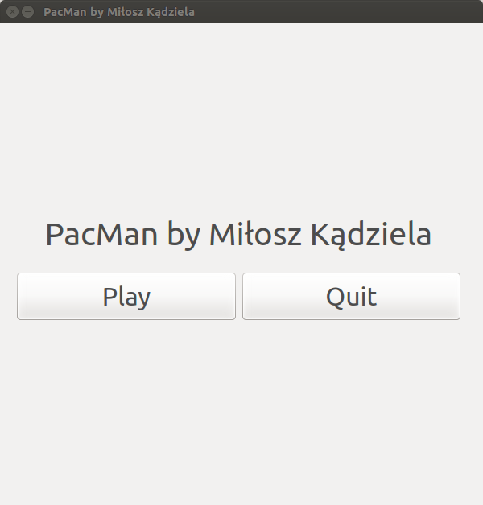
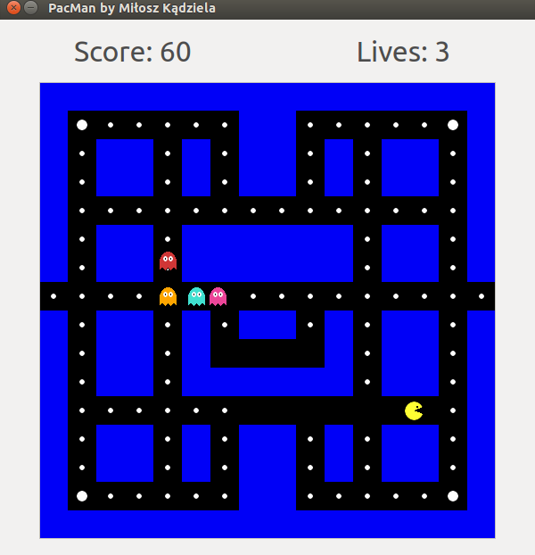

# PacMan created in Qt C++ by Milosz Kadziela

## Description:
This is my version of the popular game PacMan.

## Screenshots of the game:

## Controls:
To control the character use arrow keys (UP, DOWN, LEFT, RIGHT)

## Prerequisites:
- QT 5.5.1
- QT Creator 3.5.1

## Used technologies:
- C++
- Qt
- GIMP

## How to set up:
1. Run QT Creator
2. Open the project
3. Run the application

## Future improvements:
- Add restart option
- Create multiple maps so after eating all dots we advance a level